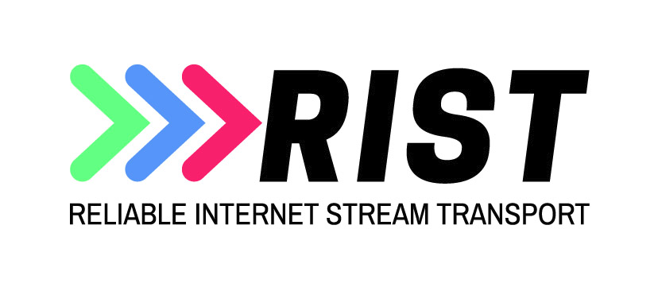

# librist

A library that can be used to easily add the RIST protocol to your application.

This code was written to comply with the Video Services Forum (VSF) Technical Recommendations TR-06-1 and TR-06-2. The protocol goes by the codename "RIST"

The canonical repository URL for this repo is https://code.videolan.org/rist/librist

This project is partially funded by the SipRadius LLC.

## Goal and Features

The goal of this project is to provide a rist library for **most platforms**.

It supports all features from the TR-06-1 and most of the features of TR-06-2.

## Dependencies

None. This library has no external runtime dependencies on any OS other than normal core OS libraries.

## License

**librist** is released under a very liberal license, a contrario from the other VideoLAN projects, so that it can be embedded anywhere, including non-open-source software; or even drivers, to allow the creation of hybrid decoders.

The reasoning behind this decision is the same as for libvorbis, see [RMS on vorbis](https://lwn.net/2001/0301/a/rms-ov-license.php3).

## Library sweet spot (optimal use cases with current defaults)

- Buffer sizes from 50 ms to 30 seconds
- Networks with round trip times from 0ms to 5000ms
- Bitrates from 0 to 1 Gbps
- Packet size should be kept under the path's MTU (typically 1500). The library does not support packet fragmentation.
- Bi-directional communication available (not one-way systems like satellite)

If you have an application that needs to operate outside the sweet spot described above, you will need to modify some constants in the rist-private.h header and/or use some of the more obscure API calls to fine tune the library for your use case. The library can overcome all the limitations above by fine-tuning with the exception of packet fragmentation which will be addressed as a feature enhancement in the future.

# Roadmap

The plan is the following:

### Reached
1. Complete C implementation of the rist protocol,
2. Provide a usable API,

### On-going
3. Improve C code base with [various tweaks](https://code.videolan.org/rist/librist/wikis/to-do),
4. Port/test on most platforms
5. Provide wrappers for other languages

# Contribute

Currently, we are looking for help from:
- C developers,
- asm developers,
- platform-specific developers,
- testers.

Our contributions guidelines are quite strict. We want to build a coherent codebase to simplify maintenance and achieve the highest possible speed.

Notably, the codebase is in pure C and asm.

We are on Telegram, on the rist_users and librist_developers channels.

See the [contributions document](CONTRIBUTING.md).

## CLA

There is no CLA.

VideoLAN will only have the collective work rights.

## CoC

The [VideoLAN Code of Conduct](https://wiki.videolan.org/CoC) applies to this project.

# Compile using meson/nija (preferred method)

1. Install [Meson](https://mesonbuild.com/) (0.47 or higher), [Ninja](https://ninja-build.org/), and, for x86\* targets, [nasm](https://nasm.us/) (2.14 or higher)
2. Alternatively, use "pip3 install meson" and "pip3 install ninja" to install them.
2. Run `mkdir build && cd build` to create a build directory and enter it
3. Run `meson ..` to configure meson, add `--default-library=static` if static linking is desired
4. Run `ninja` to compile

# Support

This project is partially funded by SipRadius LLC.

This company can provide support and integration help, should you need it.

# FAQ

## Why do you not improve srt rather than starting a new project?

- Although SRT provides a similar solution, it is the result of the vision and design of a single company. librist on the other hand, was the collective design work of a large group of experts (companies) that have been providing packet recovery services for many years. From its conception, rist has been based on clear and open standards.

## Is librist a recursive acronym?

- Yes, libRIST stands for Library - Reliable Internet Stream Transport

## Can I help?

- Yes. See the [contributions document](CONTRIBUTING.md).

## I am not a developer. Can I help?

- Yes. We need testers, bug reporters, and documentation writers.

## What about the packet recovery patents?

- This code was written to comply with the Video Services Forum (VSF) Technical Recommendations TR-06-1 and TR-06-2 and as such is free of any patent royalty payments

## Will you care about <my_arch>? <my_os>?

- We do, but we don't have either the time or the knowledge. Therefore, patches and contributions welcome.

## How can I test it?

- We have included command line utilities for windows/linux/osx inside this project. They are compiled and placed into the tools folder under the build folder.

- The Wiki has good information on the use of these utilities https://code.videolan.org/rist/librist/-/wikis/tools
